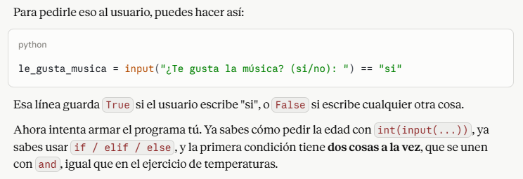

# Comentarios tarea 02
El primer problema fue desarrollado en clases en conjunto con las profesoras, por lo que se me hizo súper llevadera la elaboración del código.

Para el segundo problema seguí la misma lógica que en el primero. Solo tuve que cambiar el rango de los datos y en la parte de "elif" agregar "x % 5 == 0:" para que fuera divisible por 5 y así se imprimera "Bip" en los números correspondientes.

Para el tercer problema me guié por las indicaciones que las profesoras dieron en la última clase, donde se deben sumar las variables. En este caso fueron "suma = puntaje1 + puntaje2". Fue gratificante ver que funcionó el código y podía agregar el puntaje en las casillas, obteniendo diversos resultados según los números que se coloquen.

Para el cuarto problema tuve que pedir ayuda a la inteligencia artificial Claude, mencionada por ustedes en clases. Le expliqué lo que estabamos haciendo en general y le mandé el ejemplo de las temperaturas del problema 1 para que entendiera la lógica. 
A Claude solo le solicité ayuda porque no entendía cómo hacer los parámetros, sin embargo, no le pedí el código en sí.
Claude me guió y entendí que debía seguir los mismos pasos que en el problema 3, sólo que las dos variables (música y baile) no son números sino respuestas de sí y no. 

En base a ello, fui escribiendo el código, siguiendo la estructura similar del problema 3. Finalmente resultó el código y también fue muy gratificante ver sus respuestas.